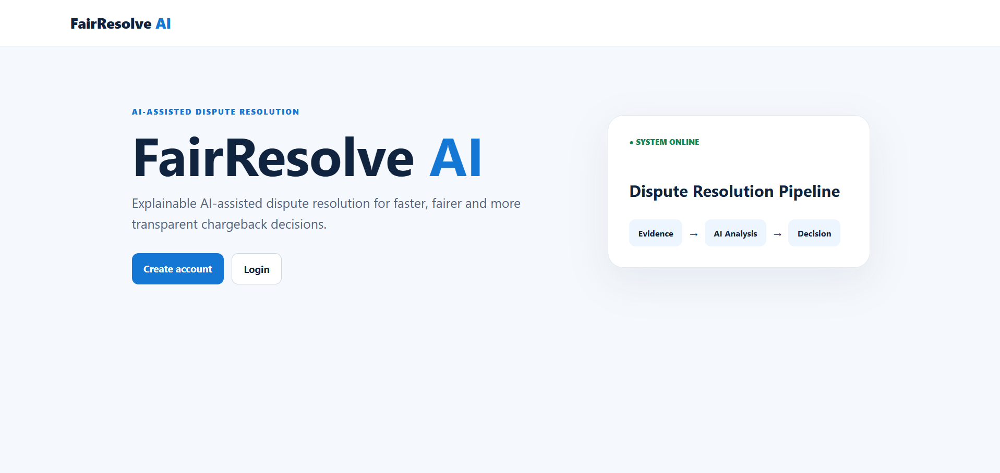
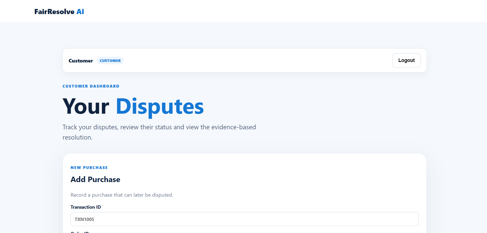
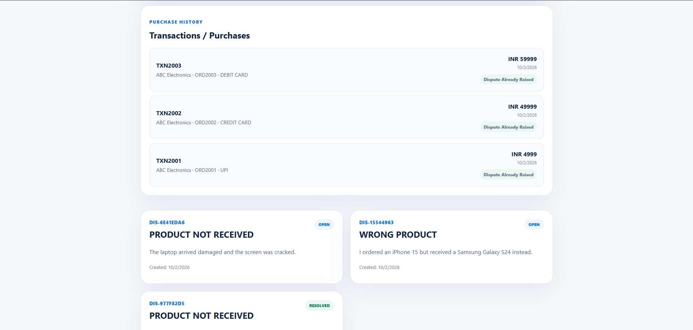
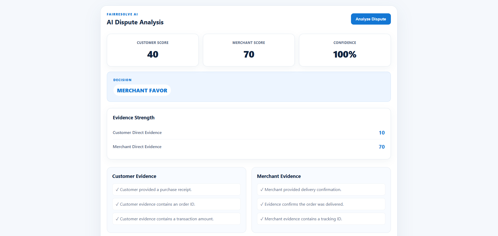
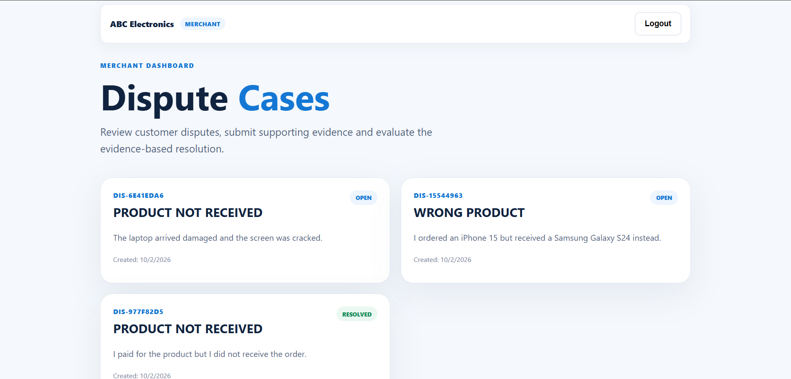
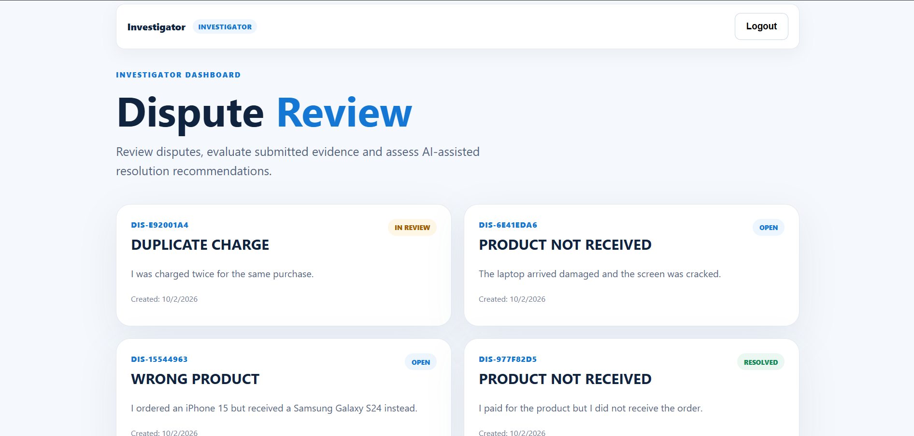
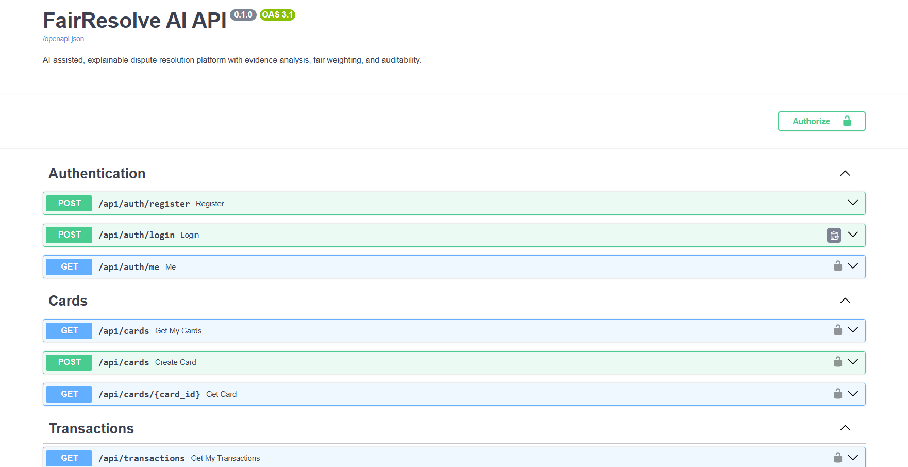

# ⚖️ FairResolve AI

### AI-Assisted Frictionless Dispute & Chargeback Resolution

FairResolve AI is a full-stack dispute and chargeback resolution platform designed to make payment disputes **faster, fairer, and more transparent**.

The platform brings together transaction information, customer and merchant evidence, Gemini-powered AI evidence understanding, explainable fairness scoring, contradiction detection, and investigator review into a single end-to-end workflow.

> Built for the **Frictionless Dispute & Chargeback Resolution** problem statement as part of **CodeStreet 2026**.

---

## 🚀 Live Demo

### Frontend
https://fair-resolve-ai.vercel.app

### Backend API
https://fairresolve-ai.onrender.com

### Swagger / OpenAPI
https://fairresolve-ai.onrender.com/docs

### Health Check
https://fairresolve-ai.onrender.com/api/health

---

## 🎯 Problem Statement

Payment disputes and chargebacks can require manual investigation across multiple sources of information.

A single dispute may involve:

- Transaction details
- Customer claims
- Merchant information
- Order information
- Receipts and invoices
- Delivery or fulfillment records
- Supporting documents

Reviewing this information manually can be time-consuming and difficult to evaluate consistently.

FairResolve AI addresses this problem by creating a structured, evidence-driven workflow that brings relevant information together and helps users understand the basis of a dispute resolution.

### Core Goal

**Faster + Fairer + More Transparent Dispute Resolution**

---

## 💡 Solution

FairResolve AI provides a centralized workflow for handling payment disputes from transaction creation through investigation and resolution.

```text
Customer
   │
   ▼
Transaction / Purchase
   │
   ▼
Raise Dispute
   │
   ▼
Customer Evidence
   │
   ▼
Merchant Evidence
   │
   ▼
AI Evidence Understanding
   │
   ▼
Structured Facts
   │
   ▼
Evidence Relevance Check
   │
   ▼
Fairness Engine
   │
   ├── Evidence Weighting
   ├── Fact Comparison
   ├── Contradiction Detection
   └── Duplicate Evidence Protection
   │
   ▼
Resolution Recommendation
   │
   ▼
AI-Assisted Explanation
   │
   ▼
Investigator Review
   │
   ▼
Audit Trail
```

The system evaluates available evidence from both sides rather than simply counting the number of uploaded documents.

---

# ✨ Key Features

## 👤 Role-Based Access & Workflows

FairResolve AI supports three user roles.

### Customer

- Create and manage purchase records
- Add UPI transactions
- Add Credit Card transactions
- Add Debit Card transactions
- Add a card during the purchase flow
- Raise disputes directly against purchases
- Upload supporting evidence
- View evidence analysis
- View dispute status and resolution information

### Merchant

- View relevant customer disputes
- Review dispute details
- Submit supporting evidence
- Analyze case evidence
- View fact comparisons
- View contradictions and evidence reasoning

### Investigator

- Review disputes
- Review customer and merchant evidence
- Run dispute analysis
- Review fairness results
- Review contradictions and facts
- Resolve disputes
- View the audit trail

---

UPI transactions can exist without an associated card, while card-based transactions can be linked to a saved card.

### Purchase Information

A purchase can contain:

```text
Transaction ID
Order ID
Merchant Name
Amount
Currency
Payment Method
Card
```

---

## ⚖️ Supported Dispute Types

FairResolve AI currently supports four dispute categories:

```text
PRODUCT_NOT_RECEIVED
WRONG_PRODUCT
PRODUCT_DAMAGED
DUPLICATE_CHARGE
```

### Product Not Received

The customer claims that the purchased product was not received.

### Wrong Product Received

The customer claims that the received product does not match the ordered or fulfilled product.

### Product Damaged

The customer claims that the delivered product was damaged, broken, cracked, or defective.

### Duplicate Charge

The customer claims that the same transaction was charged more than once.

---

## 📄 Evidence Processing

Customers and merchants can submit supporting documents such as:

- Purchase receipts
- Invoices
- Delivery confirmations
- Tracking records
- Product fulfillment records
- Product condition reports
- Duplicate-charge records
- Other supporting documents

Evidence is processed to extract useful information before it is used by the fairness engine.

---

## 🧠 Gemini-Powered AI Evidence Understanding

FairResolve AI uses the **Google Gemini API** to understand unstructured evidence documents and convert the information into structured facts.

The AI layer can extract information such as:

- Evidence type
- Order ID
- Transaction amount
- Currency
- Tracking ID
- Delivery status
- Refund status
- Date
- Ordered product
- Received product
- Damage status
- Charge count
- Evidence summary

### Example

```text
Unstructured Evidence
        │
        ▼
     Gemini AI
        │
        ▼
Structured Evidence
        │
        ▼
  Fairness Engine
```

This structured information is then passed to the existing fairness engine.

If Gemini is unavailable or returns no usable structured result, the system falls back to rule-based evidence classification and regex-based fact extraction.

Gemini can generate a human-readable explanation from the deterministic analysis results, with a rule-based explanation fallback.

---

## ⚖️ Explainable Fairness Engine

The final resolution is handled by a deterministic fairness engine rather than allowing the LLM to directly decide the dispute.

The fairness engine evaluates:

- Customer evidence
- Merchant evidence
- Evidence type
- Extracted facts
- Evidence relevance
- Evidence strength
- Fact consistency
- Contradictions
- Duplicate evidence

Possible outcomes include:

```text
CUSTOMER_FAVOR
MERCHANT_FAVOR
NEEDS_REVIEW
```

### One-Sided Evidence Protection

A dispute cannot be resolved in favor of one side simply because only that side has uploaded evidence.

When required evidence from the other side is missing, the system can return:

```text
NEEDS_REVIEW
```

This prevents premature resolution based on incomplete evidence.

### Evidence Relevance & Duplicate Protection

- Checks order ID, amount, and currency before evidence contributes to analysis.
- Prevents repeated evidence from artificially increasing scores.

---

## ⚠️ Contradiction Detection

FairResolve AI identifies important conflicts between customer and merchant evidence.

### Delivery Conflict

```text
Customer:
Product was not received

Merchant:
Order was delivered
```

### Product Conflict

```text
Customer:
Received Samsung Galaxy S24

Merchant:
Fulfilled iPhone 15
```

### Charge Conflict

```text
Customer:
Charge Count = 2

Merchant:
Charge Count = 1
```

Contradictions are displayed with severity information and become part of the explainable analysis.

---

# 🧾 Audit Trail

Important dispute actions are recorded with the actor, action, timestamp, and related details for traceability.

---

# 🏗️ System Architecture

```text
┌──────────────────────────────┐
│        React Frontend        │
│           Vite               │
│                              │
│ Customer Dashboard           │
│ Merchant Dashboard           │
│ Investigator Dashboard       │
└──────────────┬───────────────┘
               │
               │ REST API
               ▼
┌──────────────────────────────┐
│       FastAPI Backend        │
│                              │
│ Authentication               │
│ Cards                        │
│ Transactions                 │
│ Disputes                     │
│ Evidence                     │
│ AI Analysis                  │
│ Fairness Engine              │
│ Audit Logs                   │
└──────────────┬───────────────┘
               │
        ┌──────┴──────┐
        │             │
        ▼             ▼
┌──────────────┐  ┌────────────────┐
│ PostgreSQL   │  │ Gemini API     │
│   Supabase   │  │                │
│              │  │ Evidence       │
│ Users        │  │ Understanding  │
│ Cards        │  │                │
│ Transactions │  │ Explanation    │
│ Disputes     │  └────────────────┘
│ Evidence     │
│ Audit Logs   │
└──────────────┘
```

---

# ☁️ Deployment

| Component | Technology |
|---|---|
| Frontend | React + Vite |
| Frontend Hosting | Vercel |
| Backend | FastAPI |
| Backend Hosting | Render |
| Database | PostgreSQL |
| Database Hosting | Supabase |
| AI | Google Gemini API |
| Authentication | JWT |
| ORM | SQLAlchemy |
| API Documentation | Swagger / OpenAPI |
| Source Control | GitHub |
| Local Database | PostgreSQL via Docker |

---

# 🛠️ Tech Stack

## Frontend

- React
- Vite
- JavaScript
- Axios
- CSS

## Backend

- Python
- FastAPI
- Pydantic
- SQLAlchemy
- PostgreSQL
- JWT Authentication
- Passlib / bcrypt

## AI & Evidence Processing

- Google Gemini API
- Structured AI output
- PDF text extraction
- Rule-based evidence classification
- Regex-based fact extraction
- Evidence relevance filtering
- Evidence weighting
- Fact comparison
- Contradiction detection
- Duplicate evidence protection
- AI-assisted decision explanations
- Rule-based fallback processing

## Infrastructure

- GitHub
- Vercel
- Render
- Supabase
- Docker

---

# 📁 Project Structure

```text
FairResolve-AI/
│
├── backend/
│   ├── app/
│   │   ├── __init__.py
│   │   ├── main.py
│   │   ├── database.py
│   │   ├── dependencies.py
│   │   ├── models.py
│   │   ├── schemas.py
│   │   ├── security.py
│   │   │
│   │   ├── routes_auth.py
│   │   ├── routes_cards.py
│   │   ├── routes_transactions.py
│   │   ├── routes_disputes.py
│   │   ├── routes_evidence.py
│   │   ├── routes_uploads.py
│   │   ├── routes_analysis.py
│   │   └── routes_audit.py
│   │
│   │   └── services/
│   │       ├── decision_explainer.py
│   │       ├── evidence_classifier.py
│   │       ├── fact_extractor.py
│   │       ├── fairness_engine.py
│   │       ├── gemini_evidence_extractor.py
│   │       └── pdf_extractor.py
│   │
│   ├── .env.example
│   └── requirements.txt
│
├── frontend/
│   ├── src/
│   │   ├── App.jsx
│   │   ├── api.js
│   │   ├── main.jsx
│   │   └── styles.css
│   ├── index.html
│   ├── package.json
│   ├── package-lock.json
│   └── vite.config.js
│
├── screenshots/
│   ├── landing-page.png
│   ├── customer-dashboard.png
│   ├── raise-dispute.png
│   ├── ai-analysis.png
│   ├── merchant-review.png
│   ├── investigator-review.png
│   └── swagger-api.png
│
├── .gitignore
├── docker-compose.yml
└── README.md
```

---

# 🖥️ Screenshots

## Landing Page



## Customer Dashboard



## Add Purchase & Raise Dispute



## AI Evidence Analysis



## Merchant Case Review



## Investigator Review & Resolution



## Swagger API Documentation



---

# 🧪 Example Scenario

## Wrong Product Received

A customer disputes a ₹49,999 transaction because a different product was received.

```text
Transaction
    │
    ├── Transaction ID: TXN2002
    ├── Order ID: ORD2002
    ├── Amount: ₹49,999
    └── Merchant: ABC Electronics
            │
            ▼
       Customer Dispute
            │
            ▼
      Customer Evidence
            │
            ├── Ordered Product: iPhone 15
            └── Received Product: Samsung Galaxy S24
                         │
                         ▼
                     Gemini AI
                         │
                         ▼
                  Structured Facts
                         │
                         ▼
                  Merchant Evidence
                         │
                         └── Fulfilled Product: iPhone 15
                                    │
                                    ▼
                            Fact Comparison
                                    │
                                    ▼
                           Contradiction Detection
                                    │
                                    ▼
                              Fairness Engine
                                    │
                                    ▼
                         Resolution Recommendation
```

---

# 📡 API Documentation

Interactive API documentation is available through FastAPI Swagger.

### Local

```text
http://localhost:8000/docs
```

### Production

```text
https://fairresolve-ai.onrender.com/docs
```

### Main API Areas

| Area | Endpoint |
|---|---|
| Authentication | `/api/auth/register` |
| Authentication | `/api/auth/login` |
| Current User | `/api/auth/me` |
| Cards | `/api/cards` |
| Transactions | `/api/transactions` |
| Disputes | `/api/disputes` |
| Evidence | `/api/disputes/{dispute_id}/evidence` |
| Evidence Upload | `/api/disputes/{dispute_id}/upload-evidence` |
| Analysis | `/api/disputes/{dispute_id}/analyze` |
| Audit Logs | `/api/disputes/{dispute_id}/audit-logs` |
| Resolution | `/api/disputes/{dispute_id}/resolve` |
| Health | `/api/health` |

---

# 🔐 Authentication & Environment

FairResolve AI includes:

- JWT authentication
- Password hashing
- Role-based authorization
- Protected API endpoints
- CORS configuration
- Environment-based secrets
- Audit logging

Required environment variables:

```env
DATABASE_URL=your_postgresql_connection_string
SECRET_KEY=your_secret_key
GEMINI_API_KEY=your_gemini_api_key
FRONTEND_URL=http://localhost:5173

---

# 🧑‍💻 Running Locally

## Prerequisites

Make sure you have:

- Node.js
- Python 3.10+
- Docker Desktop
- Git

---

## Clone the Repository

```bash
git clone https://github.com/AdarshNayak1311/FairResolve-AI.git

cd FairResolve-AI
```

---

## Start PostgreSQL

From the project root:

```bash
docker compose up -d
```

Check the container:

```bash
docker compose ps
```

---

## Start the Backend

Open a terminal:

```bash
cd backend
```

Create a virtual environment:

```bash
python -m venv .venv
```

### Windows CMD

```bash
.venv\Scripts\activate
```

### Windows PowerShell

```powershell
.\.venv\Scripts\Activate.ps1
```

Install dependencies:

```bash
pip install -r requirements.txt
```

Create:

```text
backend/.env
```

and configure the required environment variables.

Start FastAPI:

```bash
uvicorn app.main:app --reload
```

Backend:

```text
http://localhost:8000
```

Swagger:

```text
http://localhost:8000/docs
```

Health check:

```text
http://localhost:8000/api/health
```

---

## Start the Frontend

Open another terminal:

```bash
cd frontend
```

Install dependencies:

```bash
npm install
```

Start the Vite development server:

```bash
npm run dev
```

Frontend:

```text
http://localhost:5173
```

---

Supported dispute types:

```text
PRODUCT_NOT_RECEIVED
WRONG_PRODUCT
PRODUCT_DAMAGED
DUPLICATE_CHARGE
```

### Important Analysis Behavior

If only one side has submitted relevant evidence, the system can return:

```text
NEEDS_REVIEW
```

rather than resolving the case prematurely.

---

# 📌 Design Principles

- **Faster** — Reduce repetitive manual dispute investigation.
- **Fairer** — Consider evidence from both customer and merchant.
- **Transparent** — Expose facts, comparisons, contradictions, and audit history.

---

# ⚠️ Current Limitations

The current deployment is designed for a hackathon/demo environment.

### Evidence File Persistence

Original uploaded files are not durably stored on the current free Render deployment. Extracted information is stored in PostgreSQL.

### LLM Dependency

Gemini is an external API service, so its response time and availability can vary.

FairResolve AI mitigates this through its rule-based fallback pipeline.

### Rule-Based Fairness Logic

The final fairness engine currently uses deterministic scoring and rules rather than a trained machine-learning model.

---

# 🚀 Future Improvements

Potential future improvements include:

- Durable object storage
- OCR / multimodal evidence processing
- Advanced semantic duplicate detection
- More dispute categories
- Automated unit and integration tests
- Production monitoring and observability

---

# 📄 License

This project is currently provided for **educational and hackathon purposes**.
